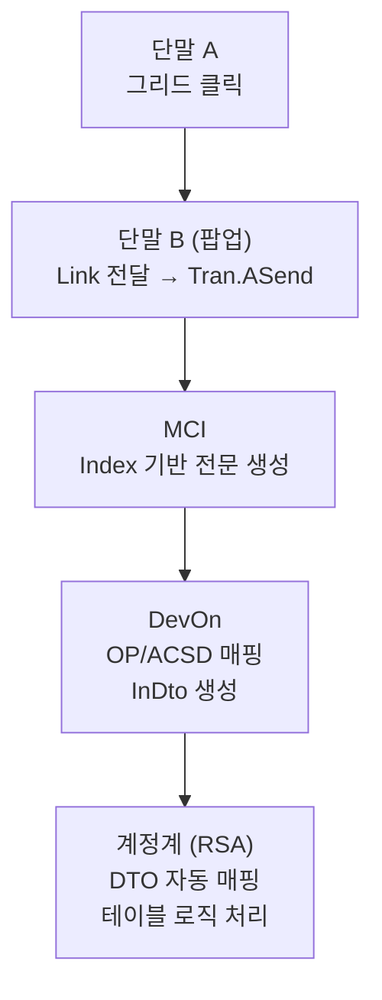

# 📅 2025-07-02 BBO048900SC2P 화면 구현

## ✅ ToDo 목록

- [x] `BBO048900SC2P` 팝업 스크립트 작성
- [x] `BBO048900SC01` → `SC2P` 팝업 호출 시 전달되는 `Link` 값 확인
- [x] `BBO0489002P` MCI, RSA 작성
- [x] `BBO_거래코드` 테이블과 조인하여 **거래명** 조회 처리

---

## 🔗 팝업 호출 시 Link 전달 항목

|Link 필드명|GetCellData 항목|설명|
|---|---|---|
|`NBW_TX_DT`|`"TX_DT"`|신한은금융망거래일자|
|`BOK_FNNW_TX_CD`|`"BOK_FNNW_TX_CD"`|한국은행금융망거래코드|
|`NBW_MESG_IDNT_VAL`|`"REF_MESG_MGMT_NO_S35"`|신한은금융망전문식별값 (S35)|

> 🔸 `Link.`로 보내는 필드명은 본인이 데이터를 보고 **의미에 맞게 직접 정의**함.

### 📜 JavaScript 전달 코드

```javascript
Link.NBW_TX_DT = grd_GRID_BBO.GetCellDataSaveName(Row, "TX_DT"); 
// 신한은금융망거래일자, 오른쪽 그리드 항목은 거래일자

Link.BOK_FNNW_TX_CD = grd_GRID_BBO.GetCellDataSaveName(Row, "BOK_FNNW_TX_CD"); 
// 한국은행금융망거래코드

Link.NBW_MESG_IDNT_VAL = grd_GRID_BBO.GetCellDataSaveName(Row, "REF_MESG_MGMT_NO_S35"); 
// 신한은금융망전문식별값, 오른쪽 그리드 항목은 전문관리번호_S35
```

---

## 🧩 MCI 설계 시 유의사항

- **그리드 반복 횟수 필드 (GRID_ROWCOUNT)**  
    → ID 및 이름은 개발자가 직접 정의 가능
- **그리드 반복 노드 이름**은 `GRID_ROWCOUNT` 이름과 **동일하게 맞춰야 함**

---

## 📦 전체 흐름 개요


---

## 📌 단계별 상세 설명

### 1️⃣ 단말 A → 단말 B (팝업 호출)

- **스크립트 코드에서 `Link.` 키워드를 이용해** 데이터 전달
- 전달 형식: **Key-Value**
- 실제로는 JSON은 아님 → 내부적으로 텍스트 기반 변환

```javascript
Link.NBW_TX_DT = grd_GRID.GetCellDataSaveName(Row, "TX_DT");
Popup("BBO0489002P", "DataLink");
```

> 이 Link 객체가 다음 단말(B 팝업)으로 **직접 주입**됨

---

### 2️⃣ 단말 B → MCI (거래 요청 시)

- 단말의 `Tran.ASend` 등으로 **거래 시작**
- 내부적으로 **MCI 전문**이 생성됨
- 이 전문은 **인덱스 기반 구조**로, 각 필드는 **정해진 순번대로** 들어감

예)

| 필드명               | 인덱스 | 값        |
| ----------------- | --- | -------- |
| NBW_TX_DT         | 1   | 20250703 |
| BOK_FNNW_TX_CD    | 2   | A123     |
| NBW_MESG_IDNT_VAL | 3   | MSG9876  |


→ 화면의 필드명이 인덱스 번호에 매핑되어 **MCI 전문 구조**로 변환됨

---

### 3️⃣ MCI → DevOn

- MCI는 **전문 통합 게이트웨이(ESB 또는 전문서버)**를 통해 **DevOn**에 전달
- DevOn에서는 전문의 **논리항목명**을 기준으로
    - ServiceID
    - InterfaceID
    - OP, ACSD 를 매핑해서 호출함

예:  
`BBO0489002P` → `ServiceID` → `OP 명령어` 호출로 연결

---

### 4️⃣ DevOn → 계정계(RSA)

- DevOn은 `InDto` 객체를 만들어 RSA로 넘김
- 이 때 필드명은 **논리코드** 기준이며, `MCI`의 필드명과 일치
- RSA에서 정의한 Java DTO 클래스의 필드명과 일치할 경우 **자동 주입**

```java
public class BBO0489002PInDto {
    private String NBW_TX_DT;
    private String BOK_FNNW_TX_CD;
    private String NBW_MESG_IDNT_VAL;
}
```

→ MCI → DevOn → RSA 간에는 **Java 객체 기반 자동 매핑 방식**

---

## 🧭 흐름도



---

## ✅ 핵심 요약

| 구간          | 방식                  | 설명                   |
| ----------- | ------------------- | -------------------- |
| 단말 → 단말     | Key-Value (`Link.`) | 팝업 호출 시 데이터 전달       |
| 단말 → MCI    | Index 기반 전문 생성      | 필드 순서대로 전문 조립        |
| MCI → DevOn | 논리항목 기준 매핑          | 서비스 식별자, OP 호출       |
| DevOn → RSA | Java DTO 자동 매핑      | 동일 필드명 → InDto 필드 주입 |

